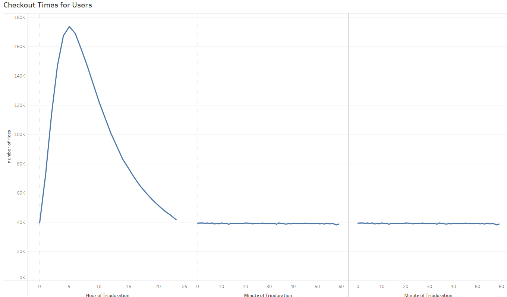
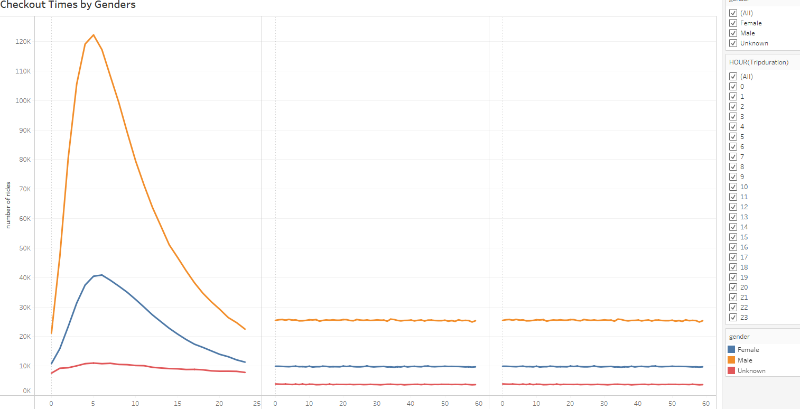
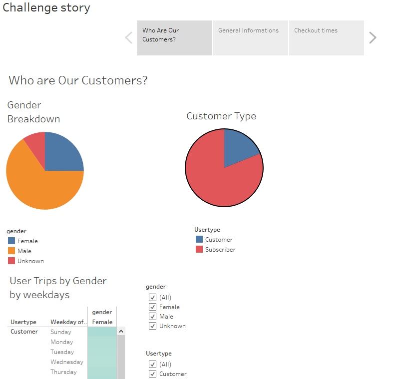
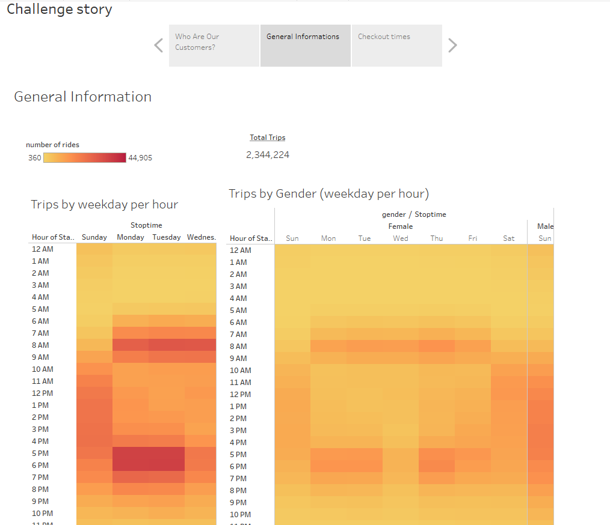
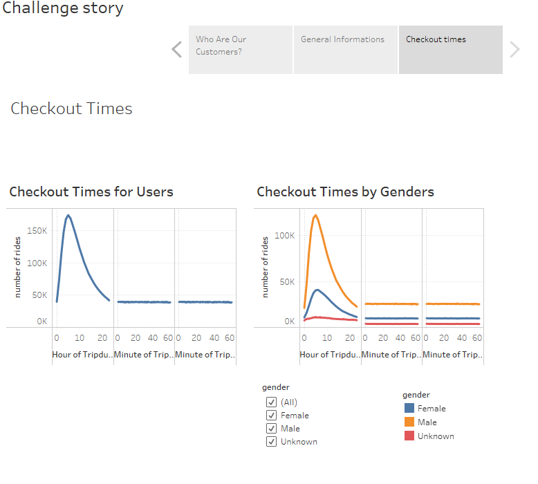

# **bikesharing**

### **Overview of The Analysis**

In this analysis we are going to perform a Bike trips Analysis for NYC in order to do that we are going to change Trip Duration to a Datetime format.Then We will be creating Several Visualizations to help make our data easier to understand by our stakeholders then we will be creating a a Story for th efinal presentation.

### **Results**

We can see that most of the riders less that half an hour since the trips are short this might result in less repairs and we can certainyl invest more to increase our fleet of bikes.

we can see that males have more longer trips than females.

We can clearly notice that we have more Male customers than females and most of cusotmer are subscribers

### **Summary**

Since This is just a one month of Data we really cant make solid conclusions ; Therfore , more data is needed.

### **LINK TO TABLEAU**

[Link to Dashboard] https://public.tableau.com/app/profile/rakan.alsharif/viz/bikesharing_challenge_16269994089180/Challengestory?publish=yes

